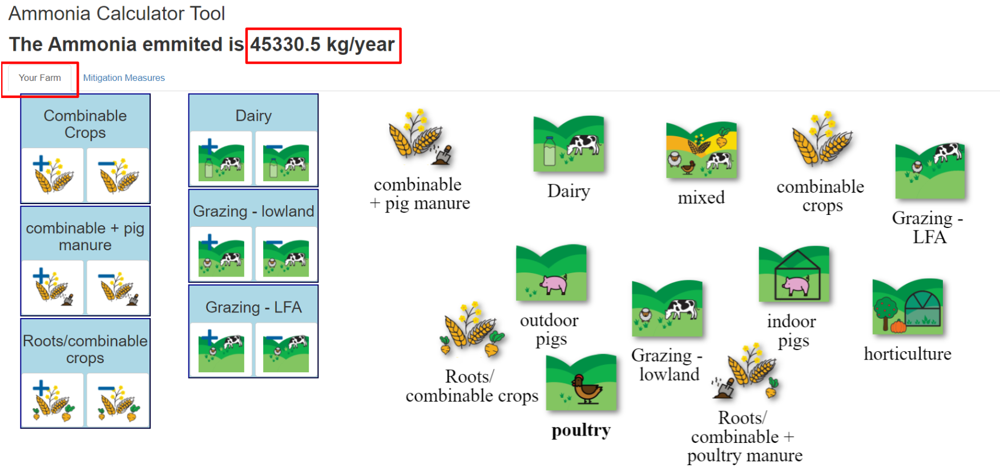
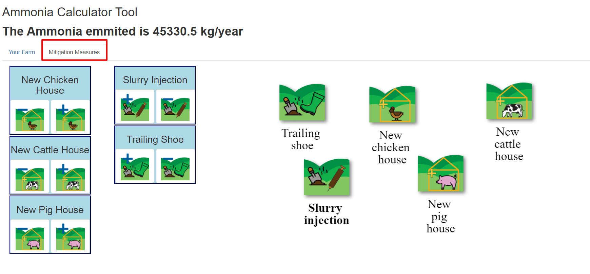
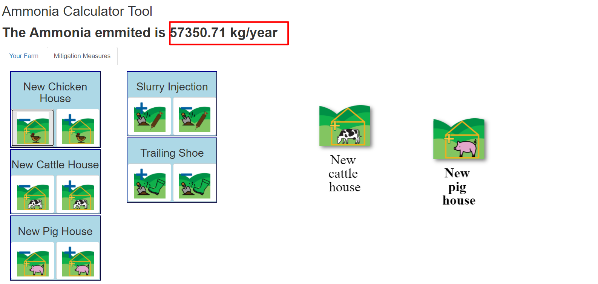
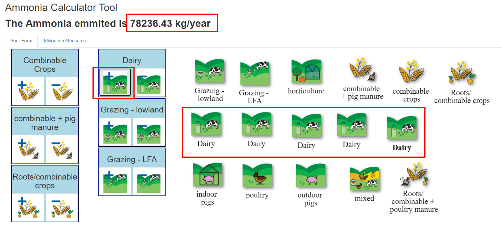

We aim to develop a data visualisation tool that explains agricultural sources of ammonia ($\mathrm{NH_3}$) and demonstrates strategies to mitigate agricultural emissions. The tool is aimed towards school-aged young people. Contrary to greenhouse gases such as $\mathrm{CO_2}$ and methane, ammonia and its impacts on vulnerable ecosystems are less widely known.

In this scoping study, we built a basic working version that we intend to expand into a fully-functioning Web App when funded.

## Approach

With the tool, the user will be able to build a farm and see the amount of $\mathrm{NH_3}$ emission caused by their action of adding or removing farm types or mitigation techniques. The effectiveness of $\mathrm{NH_3}$ mitigation techniques depends on many factors such as financial costs and suitability to the farm (e.g. ground conditions). Our tool can therefore currently only provide approximate guidance.
For the purpose of this hackathon we built a basic working version of the tool that can be applied to the UK. 

### Data acquisition

The baseline $\mathrm{NH_3}$ emission of different farm types is documented in the [UK Mitigation Methods User Guide](https://www.cost869.alterra.nl/UK_Manual_2011.pdf). The farm types used by the report are based on the Defra "Robust Farm Types" and gives total baseline losses of different pollutants for the farm typologies. We adapted these farm types and $\mathrm{NH_3}$ losses for our Web App.

There is a plethora of mitigation techniques to reduce $\mathrm{NH_3}$ emissions on farms. For this hackathon we focused on 5 techniques that are easy to implement and could directly applied to the farm types we used, namely new animal housing and two methods for slurry distribution. The data for the effectiveness of mitigation techniques were sourced from the LRTAP Guidance [Options for Ammonia Mitigation](http://www.clrtap-tfrn.org/sites/clrtap-tfrn.org/files/documents/AGD_final_file.pdf).

### Programming the Web App in RShiny

The prototype web-based tool was developed in R code with the Shiny package. Shiny is an open source R package that provides an elegant and powerful web framework for building web applications. This method allows the developers to create visual and interactive tools quickly. Numerous other R packages are used conjointly with Shiny (e.g. visNetwork, dplyr, and stringr).

The tool has an icon interface where the user can click and move the mitigation or emission icons. The user will also be able to add and remove icons to build their farm and add mitigation measures by clicking the buttons on the left. The net ammonia emissions will be calculated automatically at the top of the page when the user adds or removes icons. 

### Preparing icons for the Web App

We needed icons and add/ remove buttons for 13 farm types and 5 mitigation techniques. We designed the icons so they would be easy to identify but still adequately represent the farm type or mitigation technique they describe. To design those icons, we used the vector graphics editor Affinity Designer and sourced a couple of free-to-use icons that were integrated into our icons and adapted to match the colour scheme and aesthetics.

## Demonstration of the final product

In the image below shows the prototype of the app. The initial view shows the tab "Your Farm". A basic farm setup is pre-loaded with an ammonia emission calculated and the user can add or remove farm types.

In a second tab, called mitigation, the user can add or remove mitigation measures.

When a user removes mitigation measures the ammonia increases.

In the example below, the user selected numerous dairy items in the farm so the ammonia emission increases.

## Outlook

If funded, we intend to expand the prototype tool to include more mitigation techniques, improve functionality of the App; add information detailing the effects of $\mathrm{NH_3}$ pollution, contributors, and mitigation techniques; increase accessibility for users with visual or auditory disabilities and those whose first language is not English; and seek feedback from educators on other features they would find useful.

